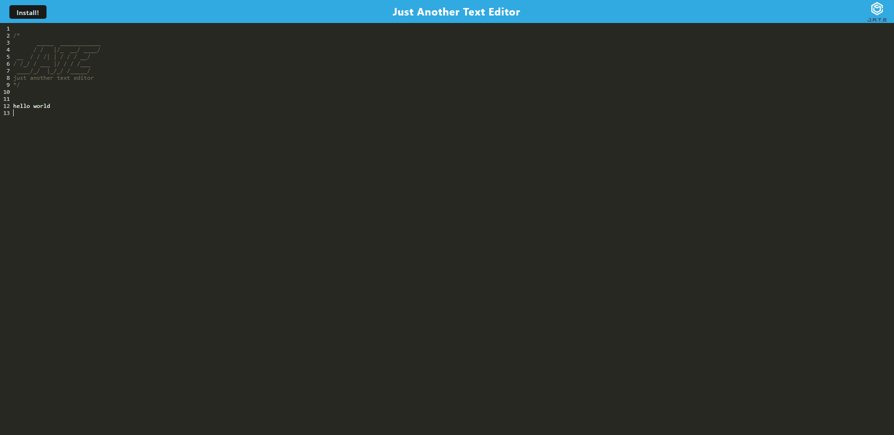

# Text Editor App

## Description

This project is a text editor made of a single page progressive web app. The app is powered by node.js and express.js on the backend and plain javascript on the frontend with help from CodeMirror for the interface and IndexedDB for data persistence, in the browser. This project serves as a tech demo, but could be useful to anyone who hasn’t heard of Microsoft Word or Google Docs.

## Table of Contents
- [Description](#description)
- [Usage](#usage)
- [Contributing](#contributing)
- [License](#license)
- [Questions](#questions)

## Usage

The site is live on the open web and can be accessed at https://text-editor-abdalla.herokuapp.com/ 

The basic usage of the site consists of being able to write text in the browser. The data is stored in the browser continuously, and can be accessed on later visits to the site.

## Contributing

The code for the basic functionality was provided by [Trilogy Education Services](https://www.trilogyed.com/universities/) and the [School of Continuing Studies - University of Toronto](https://learn.utoronto.ca/)

## License

This project is under the MIT license at [MIT](https://opensource.org/licenses/MIT)

## Questions

If you have additional questions please feel free to reach out.

Github: https://www.github.com/abdallajama201
